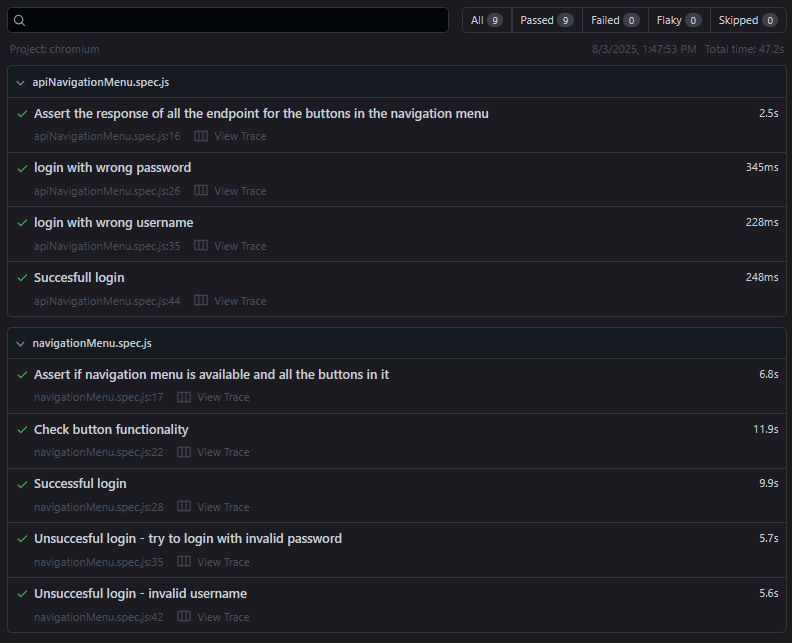
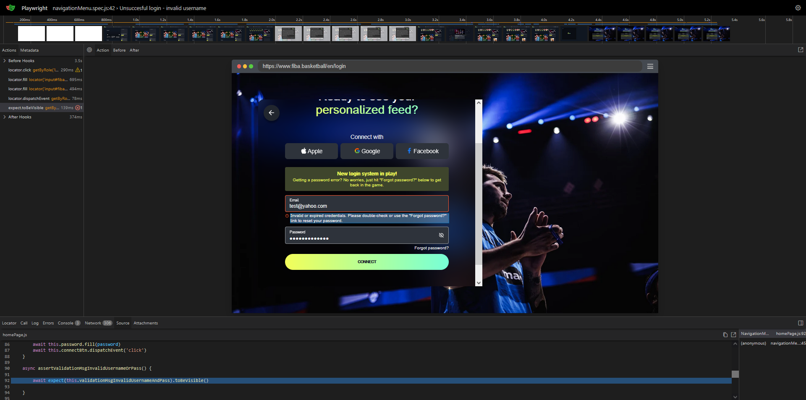
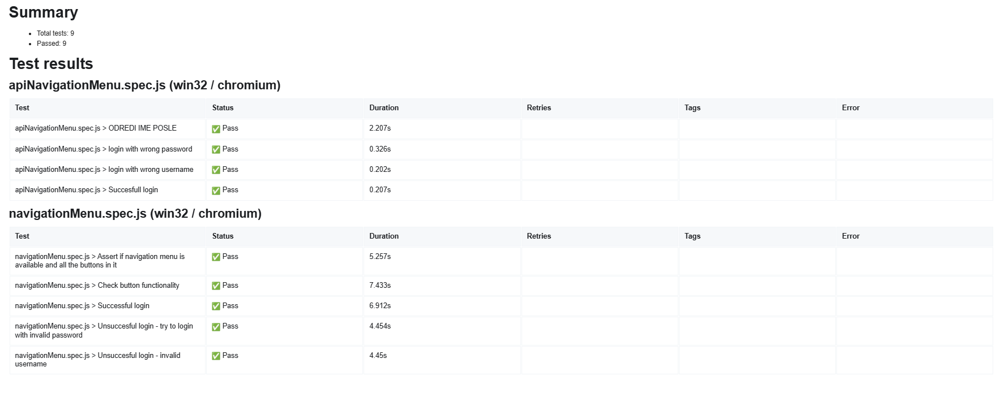

## FIBA Automation Framework

A Playwright test framework for automating UI and API testing of the [FIBA](https://www.fiba.basketball) website. Built with JavaScript and TypeScript, integrated with Jenkins for CI/CD and automated reporting.


[](https://github.com/MarkoArg20/Fiba-Automation-Framework/blob/main/Jenkinsfile)


This is a framework made using Playwright with JavScript and TypeScript. It covers the navigation menu buttons and some login scenarios. It tests both the UI and the backend for them.
It has a CI pipeline configured in Jenkins and written in Groovy (see Jenkinsfile). Also when the tests are finished it sends a message with a test report.


#Installation (run the commands in cmd)
Clone the repository to your local machine:

Navigate to the directory where you want the project:
```bash
- cd path/to/your-folder
```
Create a folder with all the files in it:
```bash
- git clone https://github.com/MarkoArg20/Fiba-Automation-Framework
```


### Run the tests:
Open the project in VS Code or preferred editor

### Install Playwright
```bash
npx install playwright
```

### Install project dependencies
```bash
npm ci
```

### Setting up Environment Variables
Create a `.env` file in the root of the project with the following content:


#### Base website URL
```bash
BASE_URL=https://www.fiba.basketball/en
```

#### API endpoints
```bash
GET_GAMES_URL=https://www.fiba.basketball/en/games?_rsc=5hm87
GET_NEWS_URL=https://www.fiba.basketball/en/news?_rsc=1y9sx
GET_EVENTS_URL=https://www.fiba.basketball/en/events/api/game-live-info/125389/light
GET_CALENDAR_URL=https://digital-api.fiba.basketball/hapi/getgdapgamesbetweentwodates?dateFrom=2025-06-01T00:00:00.000Z&dateTo=2025-06-29T00:00:00.000Z
POST_LOGIN_URL=https://auth.fiba.basketball/identity/v1/password/login
```
- add the .env file in the .gitignore file

#### Credentials (Sign up at https://www.fiba.basketball/en/register)

Provide the username and password in this variables in the .env
```bash
FIBA_USERNAME=
PASSWORD=
```

### Run the tests 
```bash
npx playwright test --headed
```

### Open the report
```bash
npx playwright show-report
```

### Jenkins CI Integration
This project includes a Jenkins pipeline defined in [`Jenkinsfile`](./Jenkinsfile).

- Tests can be run through Jenkins and its pipeline implemented in the Jenkinsfile. It can be triggered on different events or a specific time.
The .env file is passed like a secret in Jenkins. The Jenkins is run throug a VM.

How to configure Jenkins:
1. Install the GitPush plugin
2. Install the NodeJS plugin
3. Install Pipeline: GitHub Groovy Libraries
4. Create a Pipeline project
5. Set the .env file like a secret (manage Jenkins - credentials - domain (global) - Add Credentials - Paste the context of the .env)
6. Define the Pipeline (Configuration(of the build) - Pipeline - Choose pipeline script from SCM - in SCM add "Git" - in the repository URL add "https://github.com/MarkoArg20/Fiba-Automation-Framework") and in the branch specifier add */main. In the script path add "Jenkinsfile" - Save and apply
7. Click on "Build now" to run the pipeline


The framework runs with 1 worker and only on 1 browser for presenting purposes. But that can be changed in the config file.

### Sample Test Reports
#### Test report 



#### Trace report with Screenshot
(PW can take screenshots of executed steps on UI)


(this is an example of a submitted login with wrong email and correct password, where we expect validation and unathorized access )

#### Test Report sent on mail



